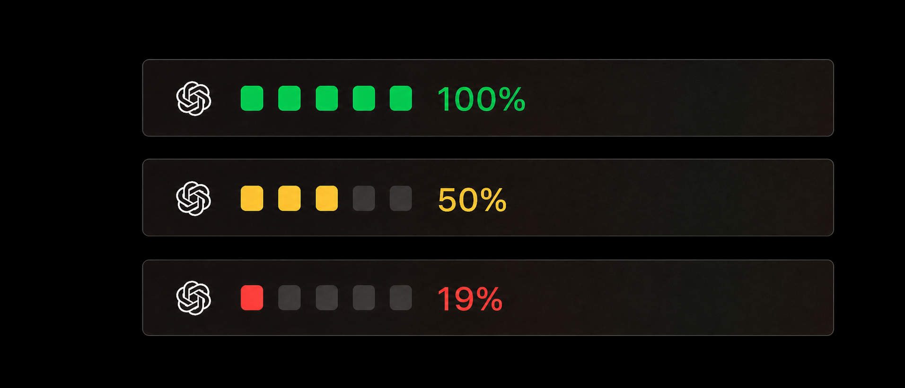
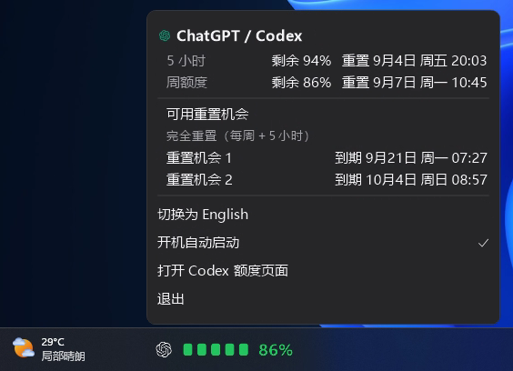

# Quota Blocks（仅保留 GPT 的个人修改版）修改记录

本版本以 [NathanCheng685/quota-blocks](https://github.com/NathanCheng685/quota-blocks) 为基础，面向个人 Windows 使用习惯进行调整。

## 保留的功能

- 读取已登录的 ChatGPT / Codex 本地额度；
- 在 Windows 任务栏显示剩余百分比和颜色状态；
- 点击后查看 5 小时、周额度及重置时间；
- 中英文切换、开机自动启动、打开 Codex 额度页面和退出。

## 本次个人修改

- 移除第二服务的代码、额度来源、详细面板行、任务栏行和菜单入口，成为 GPT / Codex 单独版本；
- 只有一个服务可用时，任务栏和详细面板不再预留另一服务的空间；
- 调整详细面板的字体、图标、行距、宽度与高度，使单服务界面更紧凑；
- 调整任务栏组件的尺寸和位置，避免与 Windows 小组件区域挤在一起；
- 将任务栏中的 ChatGPT 品牌标志改为白色；
- 使用绿色、黄色、红色表示高、中、低剩余额度；
- 读取可用的完全重置机会，按最早到期时间列出并显示到分钟；没有机会时不显示该区块；
- 将 Windows 程序与安装目录命名为 `GPT Version`，避免与旧的双服务版本混淆。

## 实际效果

## 额度颜色示例

## 与原程序对比

| 原程序任务栏效果 | 仅保留 GPT 的个人修改版 |
| --- | --- |
|  |  |

## 重置机会显示

有可用机会时，额度与菜单之间会显示独立的重置机会区块；没有机会时该区块隐藏，面板保持紧凑。

| 有可用重置机会 | 没有可用重置机会 |
| --- | --- |
|  |  |

## 版权

上述改动仅是个人定制。原项目的作者署名、版权、资源和 [MIT 许可证](LICENSE) 继续保留，版权归原作者 NathanCheng685 所有。
