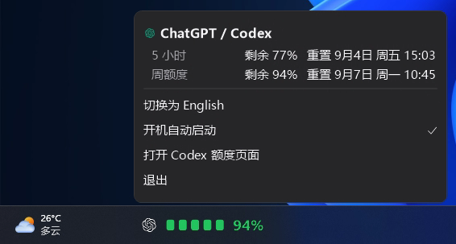

# GPT Quota Bar（个人修改版本）

一个只显示 ChatGPT / Codex 剩余额度的 Windows 任务栏工具。它以紧凑的色块和百分比展示当前额度，点击任务栏组件即可查看 5 小时与周额度的重置时间。



## 这个版本的调整

- 仅保留 GPT / Codex 的读取、显示和相关菜单；
- 任务栏只展示已安装且已登录的 Codex 数据，不出现无关的空行；
- 重新调整任务栏组件的位置、字号和区块比例，便于在 Windows 任务栏中阅读；
- 详细面板使用更清晰的字体、图标和紧凑宽度，并在只有 GPT / Codex 时自动收紧高度；
- 任务栏 ChatGPT 标志使用白色，额度以绿、黄、红三种状态显示；
- 保留中英文切换、开机启动、打开 Codex 额度页面和退出功能。

## 额度颜色

| 剩余额度 | 显示颜色 |
| --- | --- |
| 80% - 100% | 绿色 |
| 20% - 79% | 黄色 |
| 0% - 19% | 红色 |

## 安装

需要 Windows 10/11、[.NET 8 Desktop Runtime](https://dotnet.microsoft.com/download/dotnet/8.0)，以及已安装并登录的 Codex / ChatGPT 桌面应用。

在 PowerShell 中进入 `windows` 目录后运行：

```powershell
.\scripts\install.ps1
```

程序会发布到：

```text
%LOCALAPPDATA%\Programs\GPTVersion
```

可执行文件为 `GPTVersion.exe`。重新运行安装脚本即可覆盖更新。

更多技术说明见 [Windows 使用说明](windows/README.md)，本次改动范围见 [中文修改记录](CUSTOMIZATION_SUMMARY.zh-CN.md)。

## 来源与版权

本仓库基于 [NathanCheng685/quota-blocks](https://github.com/NathanCheng685/quota-blocks) 进行个人 Windows 定制。原项目的作者署名、版权、资源与 [MIT 许可证](LICENSE) 均予以保留；本仓库不主张拥有原项目的版权，也不改变其许可证要求。

这是非官方个人修改版本，与 OpenAI、ChatGPT 或 Codex 没有隶属、赞助或认可关系。相关名称和标志归其各自权利人所有。
